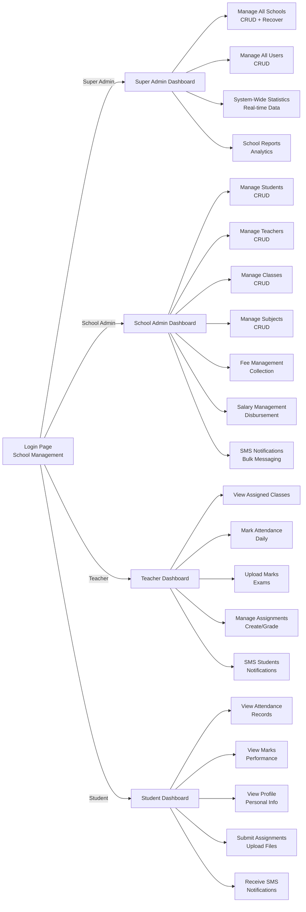
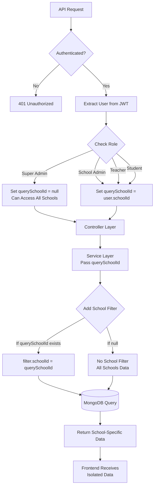
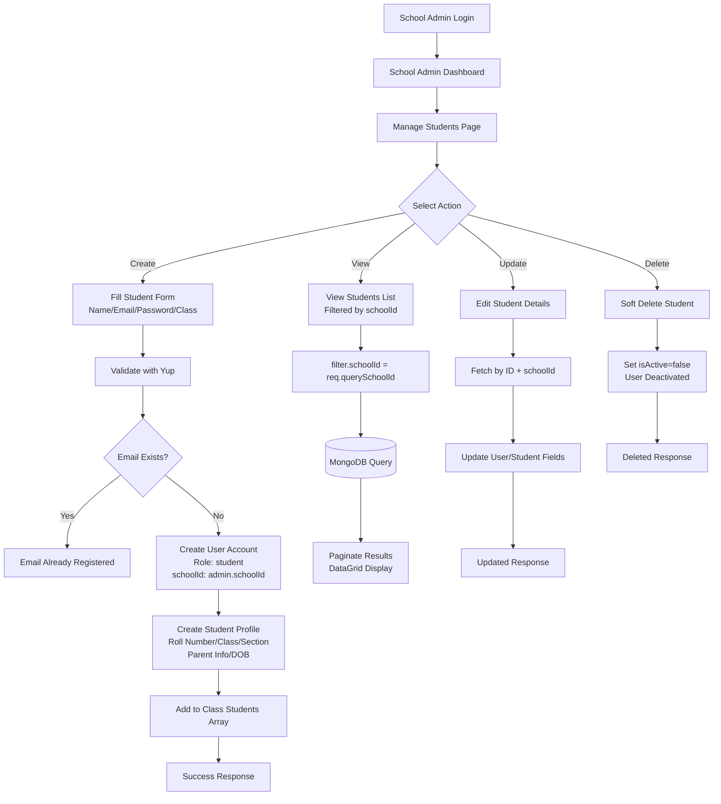
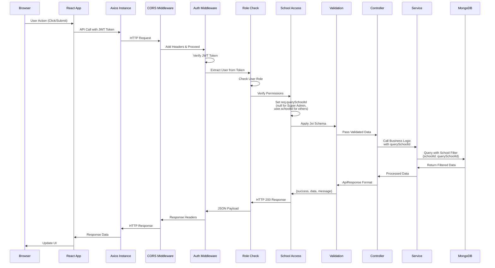
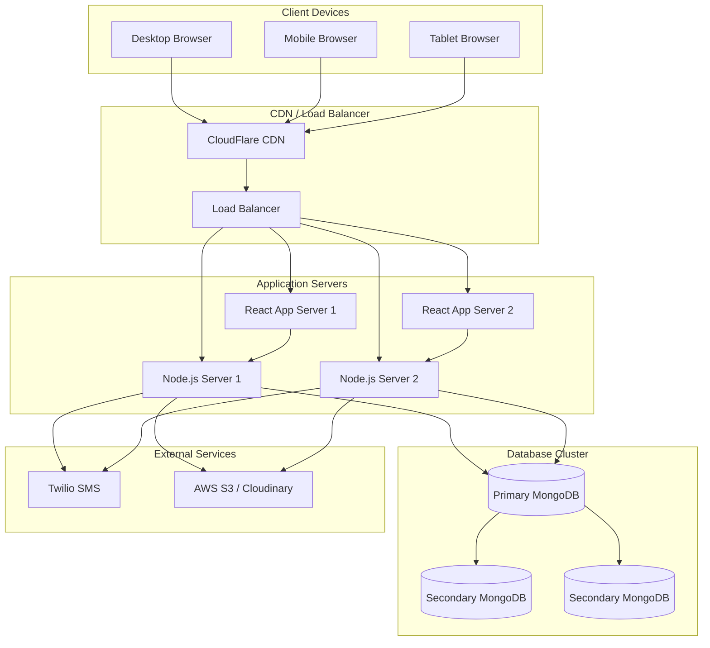

# School Management System - System Design Flow Diagram

## Architecture Overview

```mermaid
graph TB
    subgraph "Client Layer"
        UI[React Frontend<br/>Vite + MUI + Redux]
        Auth[Authentication Layer<br/>JWT Tokens]
        Routes[Role-Based Routing<br/>Super Admin/Admin/Teacher/Student]
    end

    subgraph "API Gateway Layer"
        Express[Express.js Server<br/>Port 5000]
        CORS[CORS Middleware]
        Helmet[Helmet Security]
        RateLimit[Rate Limiter]
        Morgan[Morgan Logger]
    end

    subgraph "Authentication & Authorization"
        JWTAuth[JWT Verification]
        RoleCheck[Role-Based Access Control<br/>RBAC]
        SchoolAccess[School Data Isolation<br/>Multi-Tenant]
        Validate[Request Validation<br/>Joi/Yup]
    end

    subgraph "Business Logic Layer"
        subgraph "Controllers"
            AuthCtrl[Auth Controller]
            SchoolCtrl[School Controller]
            UserCtrl[User Controller]
            StudentCtrl[Student Controller]
            TeacherCtrl[Teacher Controller]
            ClassCtrl[Class Controller]
            SubjectCtrl[Subject Controller]
            AttendanceCtrl[Attendance Controller]
            MarkCtrl[Mark Controller]
            AssignmentCtrl[Assignment Controller]
            FeeCtrl[Fee Controller]
            SalaryCtrl[Salary Controller]
            NotificationCtrl[Notification Controller]
            SMS[SMS Controller]
            Stats[System Stats Controller]
        end

        subgraph "Services"
            AuthSvc[Auth Service]
            SchoolSvc[School Service]
            StudentSvc[Student Service]
            TeacherSvc[Teacher Service]
            ClassSvc[Class Service]
            SubjectSvc[Subject Service]
            AttendanceSvc[Attendance Service]
            MarkSvc[Mark Service]
            AssignmentSvc[Assignment Service]
            FeeSvc[Fee Service]
            SalarySvc[Salary Service]
            NotificationSvc[Notification Service]
            SMSSvc[SMS Service]
        end
    end

    subgraph "Data Layer"
        Mongoose[Mongoose ODM]
        MongoDB[(MongoDB Atlas<br/>Cloud Database)]
        Models[Data Models]
    end

    subgraph "External Services"
        Twilio[Twilio SMS API]
        FileUpload[Multer File Upload<br/>Local Storage]
    end

    subgraph "Monitoring & Observability"
        Prometheus[Prometheus Metrics]
        Winston[Winston Logger]
        HealthCheck[Health Check Endpoint]
    end

    UI --> Auth
    Auth --> Routes
    Routes -->|HTTP Requests| Express
    Express --> CORS
    CORS --> Helmet
    Helmet --> RateLimit
    RateLimit --> Morgan
    Morgan --> JWTAuth
    JWTAuth --> RoleCheck
    RoleCheck --> SchoolAccess
    SchoolAccess --> Validate
    Validate --> Controllers

    Controllers --> Services
    Services --> Mongoose
    Mongoose --> MongoDB
    Mongoose --> Models

    Controllers --> FileUpload
    Services --> Twilio
    Controllers --> Prometheus
    Controllers --> Winston
    HealthCheck --> Express
```



## User Role Flow



## Multi-Tenant Data Isolation Flow



## School Lifecycle Management

```mermaid
graph LR
    Create[Super Admin Creates School]
    
    Create --> SchoolData[Collect School Details]
    Create --> AdminCreds[Collect Admin Credentials<br/>Name/Email/Password]
    
    SchoolData --> Validate{Validate Input<br/>Joi Schema}
    AdminCreds --> Validate
    
    Validate -->|Invalid| Error[Validation Error]
    Validate -->|Valid| CreateSchool[Create School Document]
    
    CreateSchool --> CreateAdmin[Create School Admin User<br/>Role: schooladmin<br/>schoolId: school._id]
    
    CreateAdmin --> Success[Return Success Response<br/>School + Admin Created]
    
    Success --> Active[School Active<br/>All Features Available]
    
    Active -->|Super Admin| Delete[DELETE School<br/>Soft Delete: isActive=false]
    
    Delete --> DeactivateUsers[Deactivate All Users<br/>isActive=false]
    
    DeactivateUsers --> Inactive[School Inactive<br/>Hidden from Lists]
    
    Inactive -->|Super Admin| Recover[PATCH /recover<br/>isActive=true]
    
    Recover --> ReactivateUsers[Reactivate All Users<br/>isActive=true]
    
    ReactivateUsers --> Active
```



## Data Flow: Student Management



## Technology Stack

```mermaid
graph TB
    subgraph "Frontend Stack"
        React[React 19.2.4<br/>UI Library]
        MUI[@mui/material v7.3.9<br/>Component Library]
        Redux[Redux Toolkit<br/>State Management]
        RTKQuery[RTK Query<br/>API Client]
        Vite[Vite 8.0.3<br/>Build Tool]
        HookForm[React Hook Form<br/>Form Management]
        Yup[Yup Validation<br/>Schema Validation]
        Axios[Axios<br/>HTTP Client]
    end

    subgraph "Backend Stack"
        Node[Node.js<br/>Runtime]
        Express[Express.js<br/>Web Framework]
        Mongoose[Mongoose<br/>MongoDB ODM]
        JWT[JSON Web Tokens<br/>Authentication]
        Joi[Joi Validation<br/>Request Validation]
        Multer[Multer<br/>File Upload]
        Morgan[Morgan<br/>HTTP Logger]
        Helmet[Helmet<br/>Security Headers]
        CORS[CORS<br/>Cross-Origin]
    end

    subgraph "Database & Storage"
        MongoDB[(MongoDB Atlas<br/>Cloud Database)]
        LocalStorage[Local File System<br/>Uploads/]
    end

    subgraph "DevOps & Monitoring"
        Nodemon[Nodemon<br/>Dev Server Reload]
        Prometheus[Prometheus<br/>Metrics Collection]
        Winston[Winston<br/>Structured Logging]
        DotEnv[dotenvx<br/>Environment Config]
    end

    React --> Redux
    Redux --> RTKQuery
    RTKQuery --> Axios
    Axios -->|HTTP/JSON| Express
    
    Express --> Mongoose
    Mongoose --> MongoDB
    
    Express --> JWT
    Express --> Joi
    Express --> Multer
    Multer --> LocalStorage
    
    Express --> Morgan
    Express --> Helmet
    Express --> CORS
    
    Node --> Nodemon
    Express --> Prometheus
    Express --> Winston
    Node --> DotEnv
```

## API Request Flow (Detailed)



## Database Schema Relationships

```mermaid
erDiagram
    School ||--o{ User : "has many"
    School ||--o{ Student : "has many"
    School ||--o{ Teacher : "has many"
    School ||--o{ Class : "has many"
    School ||--o{ Subject : "has many"
    School ||--o{ Attendance : "has many"
    School ||--o{ Mark : "has many"
    School ||--o{ Assignment : "has many"
    School ||--o{ FeeStructure : "has many"
    School ||--o{ SalaryStructure : "has many"
    School ||--o{ Notification : "has many"
    
    User ||--|| Student : "profile"
    User ||--|| Teacher : "profile"
    
    Class ||--o{ Student : "enrolled"
    Class ||--o{ Subject : "offers"
    Class ||--o| Teacher : "class teacher"
    
    Teacher ||--o{ Subject : "teaches"
    Teacher ||--o{ Class : "teaches"
    
    Student ||--o{ Attendance : "records"
    Student ||--o{ Mark : "results"
    Student ||--o{ Assignment : "submissions"
    Student ||--o{ FeePayment : "payments"
    
    Teacher ||--o{ Assignment : "creates"
    Teacher ||--o{ Attendance : "marks"
    Teacher ||--o{ Mark : "enters"
    
    User ||--o{ Notification : "receives"
    User ||--o{ SMSNotification : "sends/receives"
    
    School {
        ObjectId _id
        String name
        String code
        String address
        String phone
        String email
        String logo
        String principalName
        String affiliatedBoard
        String schoolType
        Number maxStudents
        Boolean isActive
        DateTime createdAt
    }
    
    User {
        ObjectId _id
        String name
        String email
        String password
        String role
        String phone
        ObjectId schoolId
        Boolean isActive
        DateTime createdAt
    }
    
    Student {
        ObjectId _id
        ObjectId user
        ObjectId schoolId
        String rollNumber
        ObjectId class
        String section
        Date dateOfBirth
        String gender
        String parentName
        String parentPhone
        String address
        String bloodGroup
    }
    
    Teacher {
        ObjectId _id
        ObjectId user
        ObjectId schoolId
        String employeeId
        String qualification
        Number experience
        Number salary
    }
    
    Class {
        ObjectId _id
        ObjectId schoolId
        String name
        String section
        String academicYear
        ObjectId classTeacher
        Array students
        Array subjects
    }
    
    Subject {
        ObjectId _id
        ObjectId schoolId
        String name
        String code
        ObjectId class
        ObjectId teacher
    }
```

## Security Architecture

```mermaid
graph TB
    subgraph "Security Layers"
        L1[1. Helmet - HTTP Security Headers]
        L2[2. CORS - Cross-Origin Resource Sharing]
        L3[3. Rate Limiting - Prevent Abuse]
        L4[4. JWT Authentication - Verify Identity]
        L5[5. Role-Based Access Control - Permissions]
        L6[6. School Access Middleware - Data Isolation]
        L7[7. Input Validation - Joi/Yup Schemas]
        L8[8. MongoDB Injection Prevention]
        L9[9. Password Hashing - bcrypt]
    end

    subgraph "Authentication Flow"
        Login[Login Request]
        ValidateCreds[Validate Credentials]
        GenerateJWT[Generate JWT Token<br/>{userId, role, schoolId}]
        SetCookie[Set Authorization Header]
        StoreToken[Store in Redux Store]
    end

    subgraph "Authorization Flow"
        Req[API Request]
        ExtractJWT[Extract Token]
        VerifyJWT[Verify Signature & Expiry]
        CheckRole{Role Allowed?}
        CheckSchool{School Access?}
        Allow[Allow Request]
        Deny[403 Forbidden]
    end

    Login --> ValidateCreds
    ValidateCreds --> GenerateJWT
    GenerateJWT --> SetCookie
    SetCookie --> StoreToken
    
    Req --> ExtractJWT
    ExtractJWT --> VerifyJWT
    VerifyJWT --> CheckRole
    CheckRole -->|Yes| CheckSchool
    CheckRole -->|No| Deny
    CheckSchool -->|Yes| Allow
    CheckSchool -->|No| Deny
    
    L1 --> L2
    L2 --> L3
    L3 --> L4
    L4 --> L5
    L5 --> L6
    L6 --> L7
    L7 --> L8
    L8 --> L9
```

## Deployment Architecture (Future)


